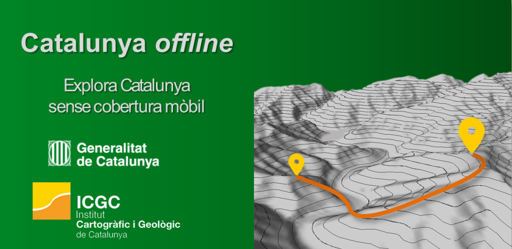

# [DEPRECATED] Catalunya Offline
> Veure i moure's sobre el mapa de Catalunya (ICGC) també sense cobertura mòbil.



Catalunya Offline és una aplicació per mòbil feta per l’Institut Cartogràfic i Geològic de Catalunya (ICGC) que us permet moure-us pel territori català, prendre punts i gravar les vostres rutes i excursions amb el GPS encara que no tingueu cobertura de dades al vostre mòbil.


*Més informació al blog de Betaportal.icgc.cat:*

[Catalunya Offline, l'app escurionista que no necessita cobertura mòbil](http://betaportal.icgc.cat/wordpress/catalunya-offline-lapp-excursionista-que-no-necessita-cobertura-mobil/)

[Últimes novetats](http://betaportal.icgc.cat/wordpress/catoffline2017nov/)

## Preparar entorn dev:

1. **Instal·lació dels plugins:**

```
ionic state restore --plugins
```

1.1 **La instal·lació del plugin de fabric, s'ha de fer a mà, afegint el propi API_KEY**

```
ionic cordova plugin add cordova-fabric-plugin --variable FABRIC_API_KEY={YOUR_API_KEY} --variable FABRIC_API_SECRET={YOUR_SECRET}
```

2. **Instal·lació de les dependencies:**

*Downloads and install npm and bower dependencies*

```
npm start
``` 

*Update devDependencies*

```
npm update --save-dev
```


3. **Afegir la plataforma Android/IOS**

```
ionic cordova platform add android
```
```
ionic cordova platform add ios
```

3.1 **Per IOS, activar el HOOK, 020_add_tags_to_plist.sh, per permetre exportar fitxers, consultar:"**

```http://matthughes.io/exporting-a-file-from-ios-with-ionic-framework/```
   
   *Si dona error d'accés, donar permisos d'execució al fitxer (chmod)*

4. Generar Splashscreen i icon

```
ionic resources
```

### A partir versió 2.0.5

La versió 1 d'ionic és considera "deprecated". A partir d'ara tenir en compte totes les següents indicacions de versionat per fer funcionar el projecte.

A continuació la info de l'entorn amb el qual a data 6/3/2019, s'ha aconseguit compilar i executar el projecte en mode dev i prod:

```
[ionic resources](Ionic:

   ionic (Ionic CLI) : 4.10.3 (C:\Users\j.sena\AppData\Roaming\npm\node_modules\ionic)
   Ionic Framework   : ionic1 1.2.4
   @ionic/v1-toolkit : 1.0.20

Cordova:

   cordova (Cordova CLI) : 8.1.2 (cordova-lib@8.1.1)
   Cordova Platforms     : android 6.0.0
   Cordova Plugins       : no whitelisted plugins (21 plugins total)

System:

   Android SDK Tools : 26.1.1 (C:\Users\j.sena\AppData\Local\Android\Sdk)
   NodeJS            : v10.15.1 (C:\Program Files\nodejs\node.exe)
   npm               : 6.4.1
   OS                : Windows 10
)
```
**IMPORATNT:** En incrementar la versió de cordova-android (+6.0.0), donava conflictes amb el plugin de fabric. 

i aquí el llistat de **plugins** amb les versions actuals:

```
com.jcesarmobile.filepicker 1.1.1 "File Picker"
com.maginsoft.mfilechooser 1.0.0 "Maginsoft FileChooser"
cordova-custom-config 3.0.0 "cordova-custom-config"
cordova-fabric-plugin 1.1.9 "cordova-fabric-plugin"
cordova-plugin-camera 2.3.0 "Camera"
cordova-plugin-compat 1.1.0 "Compat"
cordova-plugin-console 1.0.7 "Console"
cordova-plugin-device 1.1.3 "Device"
cordova-plugin-device-orientation 1.0.7 "Device Orientation"
cordova-plugin-file 4.3.0 "File"
cordova-plugin-file-transfer 1.6.0 "File Transfer"
cordova-plugin-geolocation 2.4.1-dev "Geolocation"
cordova-plugin-google-analytics 1.0.0 "Google Universal Analytics Plugin"
cordova-plugin-inappbrowser 1.5.0 "InAppBrowser"
cordova-plugin-mauron85-background-geolocation 2.2.5 "CDVBackgroundGeolocation"
cordova-plugin-network-information 1.3.0 "Network Information"
cordova-plugin-splashscreen 4.0.0 "Splashscreen"
cordova-plugin-statusbar 2.2.0 "StatusBar"
cordova-plugin-whitelist 1.3.2 "Whitelist"
cordova-plugin-x-socialsharing 5.1.3 "SocialSharing"
cordova-plugin-x-toast 2.5.2 "Toast"
cordova-plugin-zip 3.1.0 "cordova-plugin-zip"
cordova-sqlite-storage 0.7.11-dev "Cordova sqlite storage plugin"
cordova.plugins.diagnostic 3.3.2 "Diagnostic"
ionic-plugin-keyboard 2.2.1 "Keyboard"
org.pbernasconi.progressindicator 1.1.0 "Progress Indicator"
```

llistat de les versions de les llibreries de gulp (les que han donat problemes):

```
        "gulp-angular-templatecache": "2.0.0",
        "gulp-autoprefixer": "3.1.1",
        "gulp-clean": "0.3.2",
        "gulp-concat": "2.6.1",
        "gulp-minify-css": "0.3.0",
        "gulp-ng-annotate": "2.0.0",
        "gulp-uglify": "2.1.2",
        "gulp-useref": "3.1.2",
```

**IMPORTANT:** Ha estat impossible instal·lar correctament la lib de gulp-sass. És un problema pendent a resoldre si es vol tornar a publicar un nou APK.


## Crear KEYSTORE: (només una vegada)

1. **Crear keystore**
```keytool -genkey -v -keystore catoffline.keystore -alias catoffline -keyalg RSA -keysize 2048 -validity 10000```


## CREAR APK SIGNAT


1. **Canviar els fitxers index.html, gulp i els hooks, a les seves VERSIÓns de Producció, i pujar VERSIÓ del config.xml**

2. **Executar GULP**
```gulp clean default ultim```

3. **Remove plugin console**
```ionic plugin remove cordova-plugin-console```

4. **Compilar app**
```cordova build --release android```
```cordova build --release ios```

5. **Signar**
```jarsigner -verbose -sigalg SHA1withRSA -digestalg SHA1 -keystore catoffline.keystore android-release-unsigned.apk catoffline```

6. **Verify that your APK is signed**
```jarsigner -verify -verbose -certs android-release-unsigned.apk```

7. **Zip Align**
```zipalign -v 4 android-release-unsigned.apk catoffline_2.0.0.apk```


## Release History

### VERSIÓ 2.2.0
- Correcció BUG actualització ruta storagePathBase en Modificar la ruta d'emmgatzamatge
- Correció BUG mostrar coordenades incorrectes del waypoints al mapa
- Corregit problema de publicació a InstaMaps

### VERSIÓ 2.1.0
- Afegim capa raster de normals al mapa
- Eliminiem zoom flyTo en fer punt al mapa manualment
- Fix bug: afegir waypoint

###  VERSIÓ 2.0.4
- Fix bug: per Android 4 o inferior (no es poden fer bucles en format 'item of ItemList')
- Fix bug: al iniciar un track en mode VT (no es podia canviar el color)
- Eliminem els links dels popups de ExtraData (donava problemes en obrir els links des de l'app)
- Tornem a ficar les imatges de les icones de posicionament i de extradata com estaven abans de la versió 2.0.0
- En mode VT s'elemina de la icona de posicionament la fletxa (no cal, perquè no gira)
- En mode VT modifiquem l'offset de la icona de posicionament en gravar el track (ara és al centre)
- Afegim overzoom per ORTO: ampliem el zoom de la orto dos nivells més per sobre del maxNativeZoom
- Afegim overzoom per TOPO: Ampliem el zoom del topo un nivell més per sobre del maxNativeZoom
- Es disminueix el gruix de les línies en gravar traces i pujar fitxers, i es dóna transparència, per millorar la seva visibilitat sobre el mapa
- Fix bug:: Quan feies clic a més tard, no tenia en compte si després feies la descàrrega, i tornava a aparéixer el missatge


###  VERSIÓ 2.0.3
- Controlats errors al descomprimir el zip de MBTILES
- Nous tags google analytics
- Limitem Vector Tiles per VERSIÓns Android 5 o superior (la resta no WEBGL)


### VERSIÓ 2.0.2
- Canviem nom BD de llocs i elevacions perquè agafi la versió nova
- Elimienm enllaços buits dels punts d'extra data
- Arreglat bug publicar a InstaMaps


### VERSIÓ 2.0.0
- Vector Tiles + Mapbox GL JS
- Millora funcionalitat de gravar traces (punts escapats, etc)
- Actualització check de la ruta de la SD per VERSIÓns Android 6.0 i superior.

### VERSIÓ 1.0.12
- Fix bug afegir MBTiles externs

### VERSIÓ 1.0.11
- Fix bug modificar la ruta de descarrega

### VERSIÓ 1.0.10
- Fix bug moure tarja SD

### VERSIÓ 1.0.9
- Fix bug debug activat en GPS

### VERSIÓ 1.0.8
- Solucionat bug visualització camp input de login instamaps
- Canvi de plugin de geolocalització per gravar tracks, que soluciona el problema de bloqueig al gravar en segon pla
- Si es mata l'aplicació, els tracks i punts afegits sortiran per defecte activats quan entra al mapa corresponent


### VERSIÓ 1.0.7
- MOdificació del plugin mFileChooser, per controlar actualització Android 6.0.1, on s'ha canviat el nom de muntatge de les SD, cosa que feia que no es trobes el seu path extern
- Modificacions per us a la VERSIÓ IOS (afegir mbtiles i capes extres)


### VERSIÓ 1.0.6
- Modificació plugin sqliteplugin, per permetre obrir bases de dades en mode lectura, i per tant, poder treballar amb
mbtiles guardats a qualsevol ruta de la tarja SD externa


### VERSIÓ 1.0.5
-	Possibilitat de modificar la ruta de descàrrega dels mapes manualment
-	Nova funcionalitat que permet afegir capes d’informació addicional als mapes, sobre càmpings, albergs, refugis i turisme rural.
-	Nova funcionalitat per afegir altres mapes (en format MBTILES)
-	Possibilitat de moure l’aplicació a la targeta externa del dispositiu
-	Modificades les unitats de distància de les traces de metres a kilòmetres.
-	Millorat el comportament en cas de pèrdua de senyal GPS mentre es grava una traça
- Actualització dels noms dels fulls amb els parcs


### VERSIÓ 1.0.4

- Durant la gravació de les traces es pot anar consultant la distància actual
- Diàleg de confirmació de sortida des de el nav-back-button mentre es grava track
- Diàleg de confirmació de sortida des de hardware back button mentre es grava track
- Al publicar a InstaMaps, el nom per defecte es buida, un cop s'ha fet servir
- Corregit problema al crear un traça d'un sol punt (LineString d'un punt)
- Afegit sistema de logs per activar mode debug en cas que sigui necessari
- Afegida la opció de cancel·lar una descàrrega iniciada, però no finalitzada
- Tallar número de decimals de les coordenades al compartir
- Detectar permisos per VERSIÓ android 6
- Upgraded Cordova android 5.2


### VERSIÓ 1.0.3

- bug base de dades fixed


### VERSIÓ 1.0.2

- Adaptada aplicació per funcionament en IOS
	*Solucionat bug creació fitxers GPX i KML
	*Modificat plugin google analytics a 1.0.0, sino conflicte amb normativa IDFA Apple
	*Fet servir plugin sql lite VERSIÓ ext (no el que es fa servir a la VERSIÓ Android)
	*La forma de descarregar/carregar fitxers és completament al núvol (no es treballa amb la memòria del dispositiu)

- Llistat ordenat per descarregats


### VERSIÓ 1.0.1

- Nova funcionalitat de cerca de llocs i elevacions
- Possibilitat de pujar les fotos al publicar a InstaMaps
- Solucionat el problema en descarregar mapes en 3G


## Captura errors crashlytics:

https://get.fabric.io/

## License

Copyright (c) 2017- Geostarters (MIT License)  
See LICENSE file for more info.

